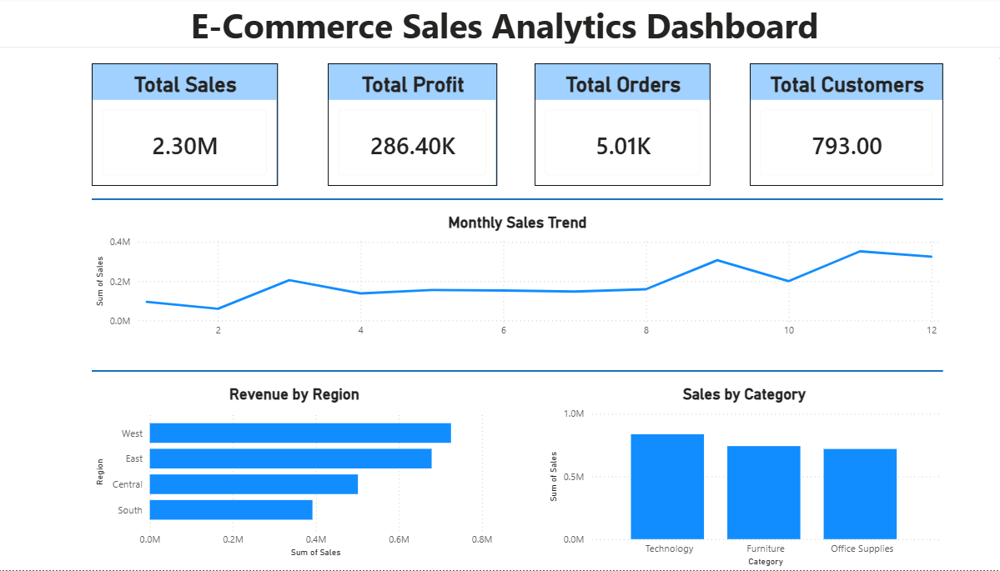
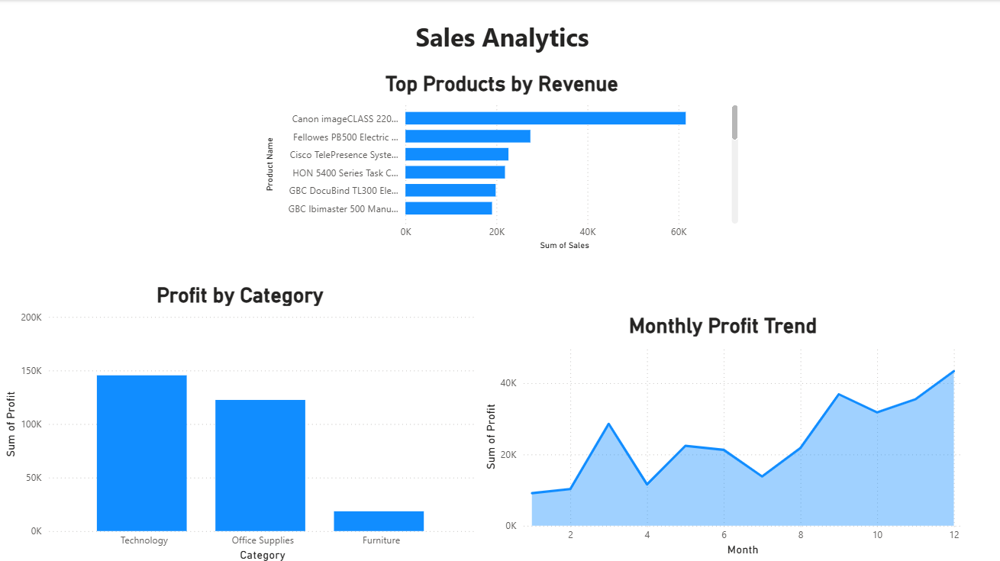
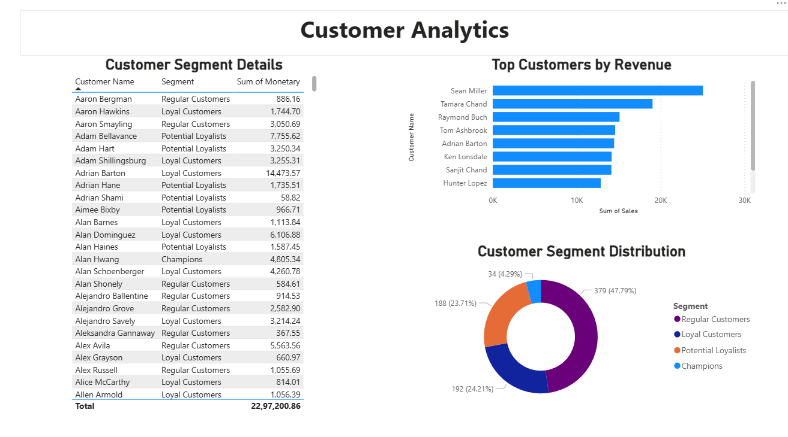
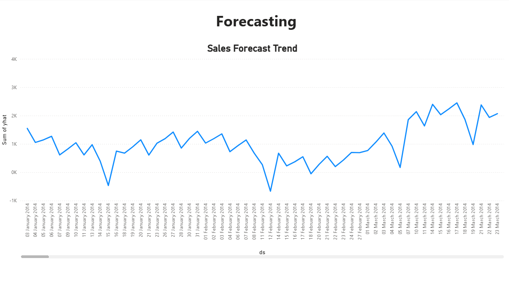

# E-Commerce Sales Analytics Dashboard

An end-to-end Data Analytics project built using **Python, SQL, Pandas, Matplotlib, Power BI, and SQLite** to analyze retail sales data, uncover business insights, perform customer segmentation, and forecast future sales trends.

---

##  Project Overview

This project demonstrates a complete analytics workflow:

- Data Cleaning & Preprocessing
- Exploratory Data Analysis (EDA)
- Business KPI Analysis
- SQL-Based Analytics
- Customer Segmentation
- Sales Forecasting
- Interactive Power BI Dashboard

The goal is to transform raw sales data into actionable business insights for decision-making.

---

##  Tech Stack

### Programming & Analysis
- Python
- Pandas
- NumPy

### Visualization
- Matplotlib
- Power BI

### Database
- SQLite
- SQL

### Development Tools
- Jupyter Notebook
- VS Code
- Git & GitHub

---

##  Project Structure

```text
ECOMMERCE_SALES_ANALYTICS
│
├── assets/
│   ├── executive_dashboard.png
│   ├── sales_analytics.png
│   ├── customer_analytics.png
│   └── forecasting.png
│
├── dashboards/
│   └── ecommerce_dashboard.pbix
│
├── data/
│   ├── raw/
│   └── processed/
│
├── notebook/
│   └── 01_data_cleaning.ipynb
│
├── reports/
│   ├── category_sales.csv
│   ├── customer_segments.csv
│   ├── forecast.csv
│   ├── monthly_profit.csv
│   ├── monthly_sales.csv
│   ├── profitability.csv
│   ├── region_sales.csv
│   ├── top_customers.csv
│   └── top_products.csv
│
├── sql/
│   ├── customer_analysis.sql
│   ├── profitability_analysis.sql
│   └── revenue_analysis.sql
│
├── src/
│   ├── data_cleaning.py
│   ├── business_analysis.py
│   ├── customer_segmentation.py
│   ├── forecasting.py
│   ├── sql_analysis.py
│   ├── dashboard_data.py
│   ├── create_database.py
│   └── visualizations.py
│
├── visuals/
│   ├── category_sales.png
│   ├── region_sales.png
│   └── forecast.png
│
├── main.py
├── requirements.txt
└── README.md
```

---

##  Key Business Metrics

| Metric | Value |
|----------|----------|
| Total Sales | $2.30M |
| Total Profit | $286.40K |
| Total Orders | 5,009 |
| Total Customers | 793 |

---

## Dashboard Pages

### Executive Dashboard

Features:

- Total Sales
- Total Profit
- Total Orders
- Total Customers
- Monthly Sales Trend
- Revenue by Region
- Sales by Category



---

### Sales Analytics

Features:

- Top Products by Revenue
- Profit by Category
- Monthly Profit Trend



---

### Customer Analytics

Features:

- Customer Segment Distribution
- Top Customers by Revenue
- Customer Segmentation Analysis



---

### Forecasting

Features:

- Sales Forecast Trend
- Future Revenue Prediction



---

## Analysis Performed

### Data Cleaning

- Removed duplicate records
- Handled missing values
- Converted date columns
- Created Year, Month, and Quarter features

### Business Analysis

- Revenue Analysis
- Profitability Analysis
- Regional Performance Analysis
- Product Performance Analysis

### Customer Segmentation

Customers were segmented into:

- Champions
- Loyal Customers
- Potential Loyalists
- Regular Customers

### Forecasting

- Time Series Analysis
- Future Sales Prediction
- Trend Identification

---

## SQL Analysis

The project includes SQL queries for:

- Revenue Analysis
- Profitability Analysis
- Customer Analysis

Executed using SQLite for business reporting.

---

## How to Run

### Clone Repository

```bash
git clone https://github.com/Girishg0wda/ecommerce-sales-analytics-dashboard.git
```

### Install Dependencies

```bash
pip install -r requirements.txt
```

### Run Complete Pipeline

```bash
python main.py
```

---

## Key Insights

- Generated over **$2.29 Million** in sales revenue.
- Technology is the highest-performing category.
- West region contributes the highest revenue.
- Identified high-value customer segments.
- Forecasting reveals future growth trends and seasonal patterns.

---

## Resume Highlights

- Analyzed retail sales data using Python, SQL, and Pandas.
- Built Power BI dashboards for business intelligence reporting.
- Performed customer segmentation and forecasting analysis.
- Generated actionable insights from sales and profitability data.
- Developed an end-to-end analytics pipeline from raw data to dashboard.

---

## Author

**Girish Gowda**

Aspiring Data Analyst | Python | SQL | Power BI | Machine Learning

GitHub: https://github.com/Girishg0wda
